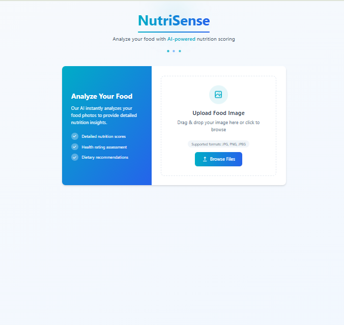
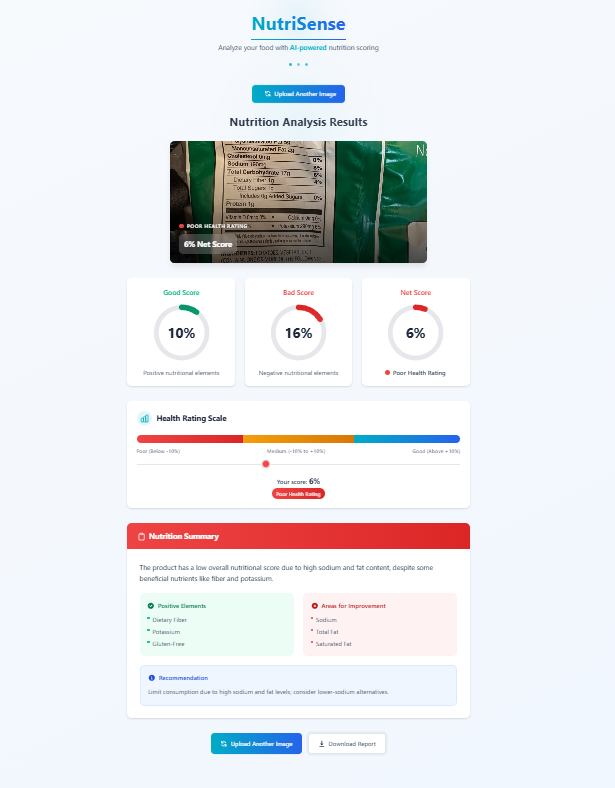

# NutriSense: Uncover Your Food's Hidden Health Score

NutriSense is an innovative food nutrition analysis application powered by Generative AI. It processes an uploaded food label image, extracts text using OCR, and then leverages a custom Yuka-inspired metric along with a cutting-edge LLM API to calculate detailed nutrition scores and provide dynamic summary insights. These insights help users understand the nutritional benefits, risks, and improvement areas of their food products.

---

## Table of Contents

- [Features](#features)
- [Architecture](#architecture)
- [Setup & Installation](#setup--installation)
- [How It Works](#how-it-works)
- [Running the Application](#running-the-application)
- [Technologies Used](#technologies-used)
- [License](#license)

---


<div style="display: flex; justify-content: center; align-items: center;">
  
  
</div>

---

## Features

- **Image Upload & OCR:**  
  Users can upload an image of a food label. NutriSense uses OpenCV and [pytesseract](https://github.com/madmaze/pytesseract) to extract text from the image.

- **Custom Nutrition Metric:**  
  A Yuka-inspired metric calculates:
  - **Nutritional Benefit Score:** Based on beneficial nutrients (fiber, protein, vitamins, minerals).
  - **Nutritional Risk Score:** Based on components to limit (fats, cholesterol, sodium, sugars).
  - **Overall Nutrition Score:** The net score (benefit minus risk) with an associated health rating.
  - **Additives & Sodium Percentages:** Direct extraction of these values from the label.

- **Dynamic Summary Generation:**  
  The LLM API returns a summary including:
  - An overview of the overall nutritional quality.
  - A recommendation statement.
  - Lists of positive nutritional elements and areas for improvement.

- **Generative AI Integration:**  
  The app leverages a state-of-the-art LLM API (via OpenRouter) to compute scores and generate natural language summaries strictly based on the label data provided.

---

## Architecture

NutriSense consists of two main components:

1. **Flask Backend (Server):**  
   - Accepts the uploaded image.
   - Processes the image using OpenCV and pytesseract to extract text.
   - Constructs a custom prompt that instructs the LLM to compute nutrition scores and generate summary details.
   - Calls the LLM API and parses its response.
   - Returns a JSON object containing the calculated scores and summary.

2. **React Frontend (Client):**  
   - Provides the user interface for uploading images.
   - Displays the nutrition scores and summary details in an interactive dashboard.
   - Allows users to download detailed reports.

---

## Setup & Installation

### Prerequisites

- **Node.js** and **npm** (for the client)
- **Python 3.8+** (for the server)
- **Tesseract OCR** installed on your machine (with English language pack)

### Installation Steps

1. **Install Client Dependencies:**

   Open a terminal and run:
   ```bash
   cd ./clients
   npm install
    ```

1. **Install Server Dependencies:**

   Open a new terminal and run:
   ```bash
    cd ./server
    npm install
    ```
--- 

## How It Works
1. **Image Input**: The user uploads an image of a food product label through the frontend.

2. **Text Extraction**: The Flask backend uses OpenCV and pytesseract to extract text from the image.

3. **Prompt Construction**:
    - The extracted text is inserted into a custom prompt that:

    - Describes a Yuka-inspired metric

    - Instructs the LLM to compute:

    - Nutritional Benefit Score**:

    - Nutritional Risk Score

    - Overall Nutrition Score (with health rating)

    - Additives Percentage

    - Sodium Percentage

    - Requests a detailed summary including an overview, recommendation, positive elements, and areas for improvement.

4. **LLM API Call**: The backend sends the prompt to the LLM API via OpenRouter. The LLM processes the context and returns exactly formatted lines with the calculated scores and summary details.

5. **Response Parsing & Fallbacks**: The backend parses the response, converting the scores to integers and extracting the summary fields. If any field is missing, default values are generated.

6. **Result Display**: The final JSON response is sent to the frontend, where the nutrition scores and summary are rendered on an interactive dashboard.


## Running the Application
- Starting the Server by opening  a terminal and navigate to the server directory and run the flask server:

    ```bash
    cd ./server
    python ./app.py
    ```


- Now in a separate terminal, navigate to the client directory and run the development server:

    ```bash
    cd ./clients
    npm run dev
    ```
    
- Open your browser and navigate to the provided URL (typically http://localhost:3000) to interact with NutriSense.